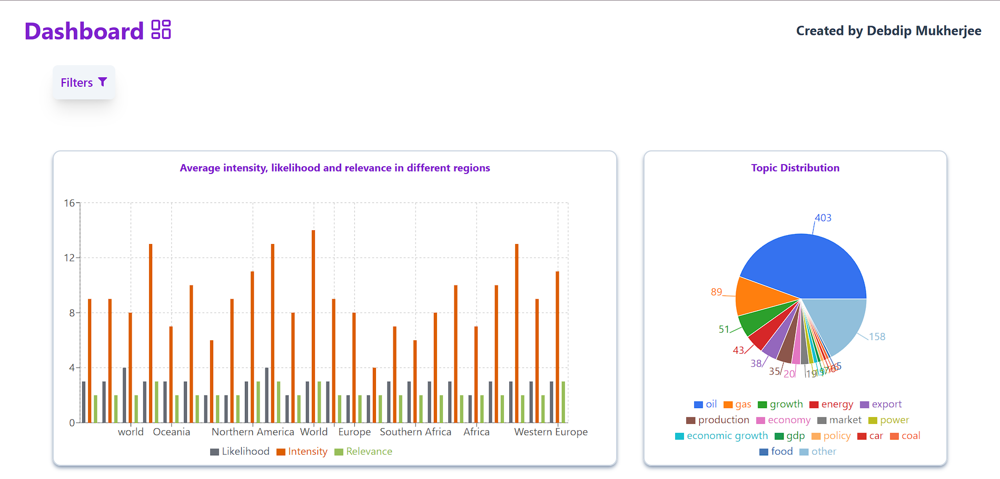
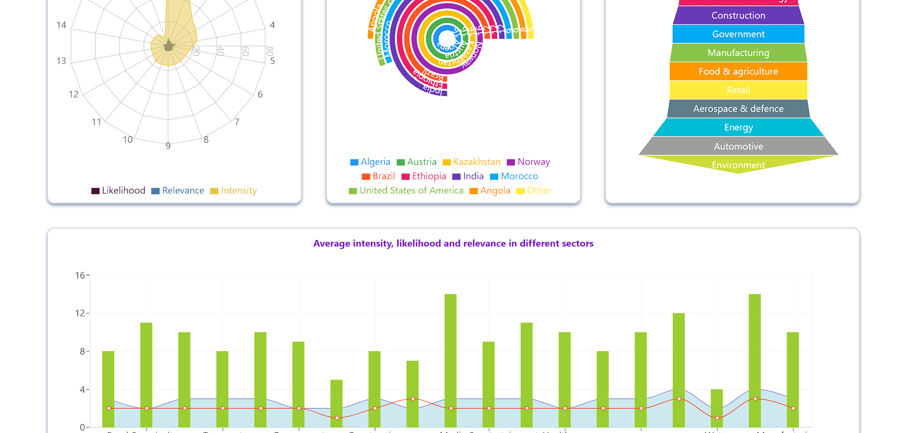
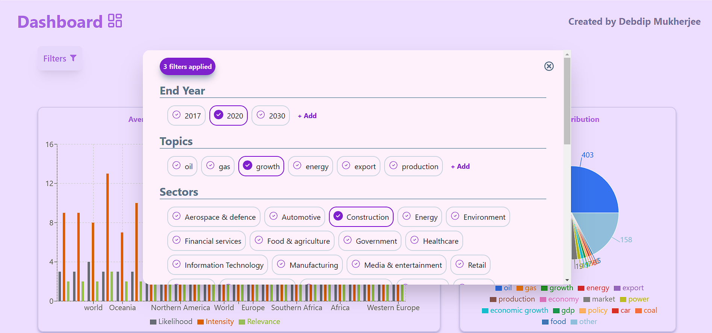

# Data Visualization Dashboard
This project aims to visualize and analyze insights data collected from various sources. The dataset includes information such as intensity, likelihood, relevance, and other metrics related to different topics across regions and countries.

## Data Source
The data used in this project is sourced from diverse publications and articles, capturing insights on economic, social, and geopolitical factors. Each entry provides detailed information about the source, publication date, country, and relevance of the insight.

## Purpose
The primary goal of this project is to provide visual insights into the dataset using various types of charts. These visualizations help in understanding:
- Trends and patterns over time
- Regional variations in intensity, likelihood, and relevance
- Distribution of topics and their impact across different countries

## Project Structure
The project includes the following visualizations:

1. **Bar Chart**: Compares the average likelihood, intensity, and relevance based on regions.
2. **Pie Chart**: Displays the distribution of topics by count.
3. **Line Chart**: Shows the trend of average intensity over time (using publication dates).
4. **Radar Chart**: Compares average likelihood, intensity, and relevance across different topics.
5. **Composed Chart**: Integrates an area chart, bar chart, and line chart to analyze metrics across sectors or topics.
6. **Scatter Chart**: Analyzes the relationship between two metrics, such as intensity vs. likelihood and intensity vs. relevance

## Tech Stack

**Client:** React, Tailwind CSS, Redux-Toolkit, Recharts

**Server:** Node.js, Express.js, MongoDB, Mongoose

## Demo

https://visuals-dashboard.vercel.app/

## Installation

Install visuals-dashboard with npm

```bash
  git clone https://github.com/DebdipWritesCode/VisualsDashboard.git
```

Frontend

```bash
  cd Frontend
  npm install
  npm run dev
```
Backend

```bash
  cd Backend
  npm install
  cd api
  node index.js
```
## Screenshots




